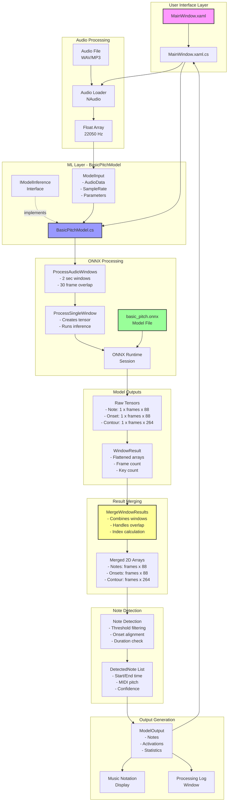
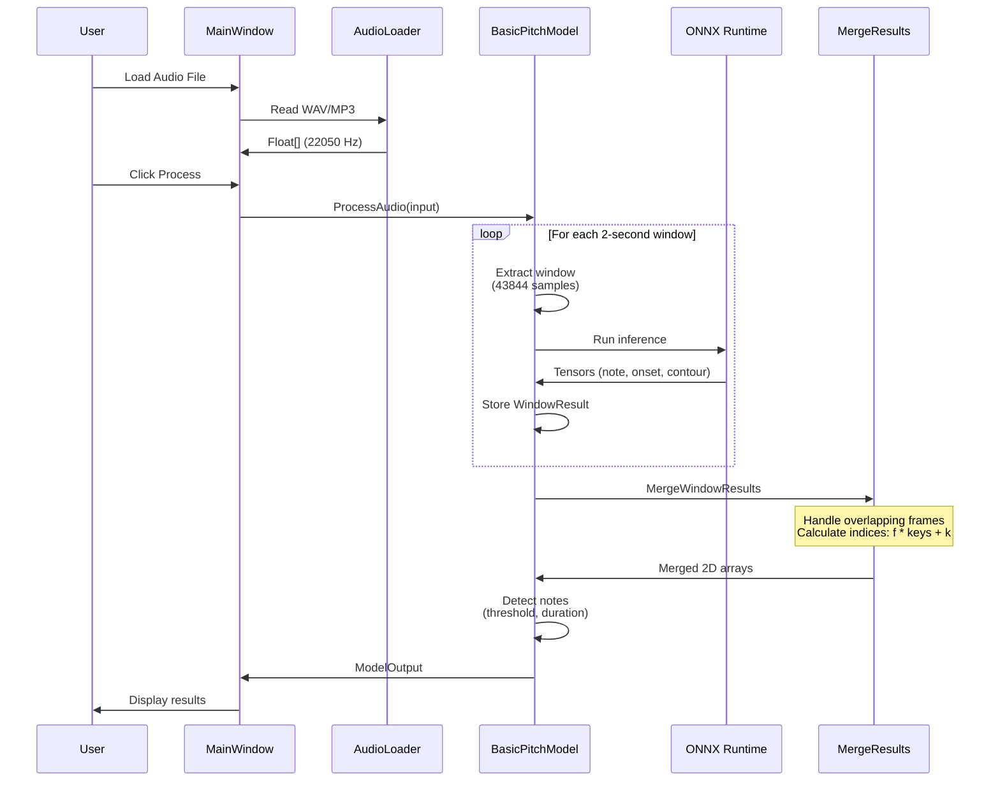
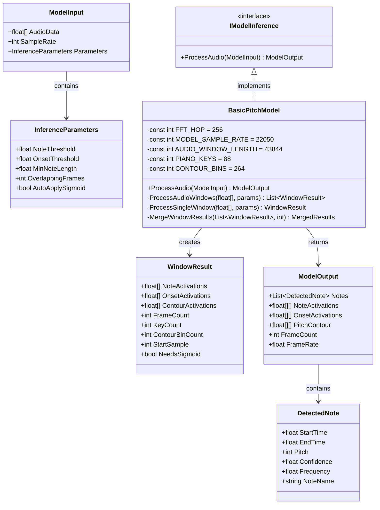
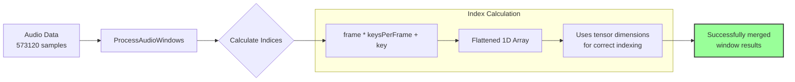
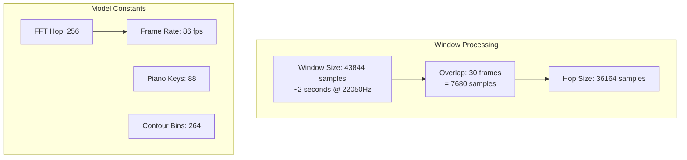
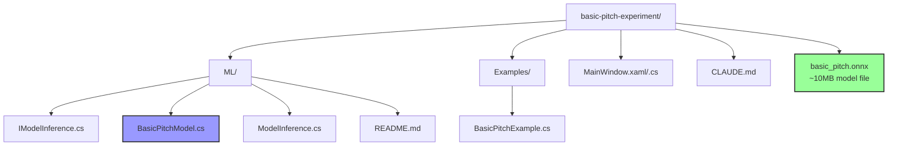

# Basic Pitch Experiment - Architecture Diagram

## Project Structure and Data Flow

## Data Flow Detail

## Key Components

## Index Calculation Flow

## Processing Parameters

## File Structure

## Technical Notes

1. **Window Processing**: Audio is processed in ~2 second windows with 30-frame overlap
2. **Tensor Handling**: 3D tensors from ONNX are flattened to 1D arrays for processing
3. **Index Calculation**: Uses formula `frame * keysPerFrame + key` to access flattened data
4. **Model Output**: Generates piano roll representation with 88 keys and pitch contour with 264 frequency bins