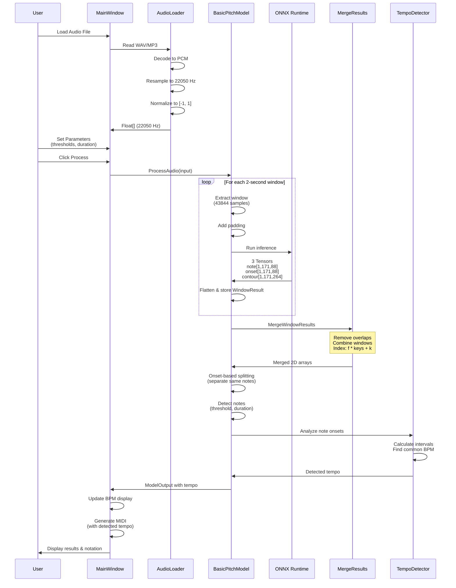
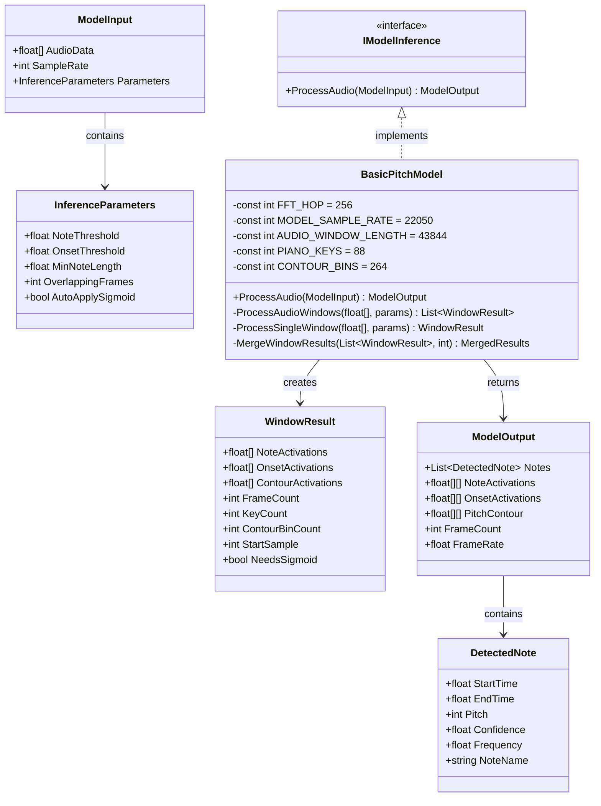
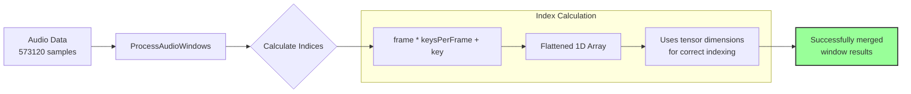
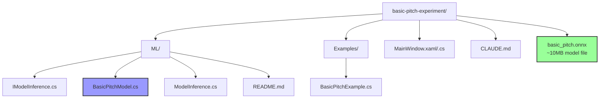

# Basic Pitch Experiment - Architecture Diagram

## Project Structure and Data Flow

```mermaid
graph TB
    subgraph "User Interface Layer"
        UI[MainWindow.xaml]
        UICode[MainWindow.xaml.cs]
        UIControls[UI Controls<br/>- BPM: Manual/Detected<br/>- Thresholds<br/>- Note Duration]
        UI --> UICode
        UICode --> UIControls
    end

    subgraph "Audio Processing Pipeline"
        AudioFile[Audio File<br/>WAV/MP3]
        
        subgraph "Audio Loading"
            AudioLoader[NAudio Library]
            AudioDecoder[Audio Decoder<br/>- MP3 → PCM<br/>- WAV → PCM]
            Resampler[Resampler<br/>Target: 22050 Hz]
            AudioNorm[Normalization<br/>Float32 [-1, 1]]
        end
        
        AudioData[Float Array<br/>22050 Hz Mono]
        
        AudioFile --> AudioLoader
        AudioLoader --> AudioDecoder
        AudioDecoder --> Resampler
        Resampler --> AudioNorm
        AudioNorm --> AudioData
    end

    subgraph "ML Layer - BasicPitchModel"
        IModel[IModelInference<br/>Interface]
        BPModel[BasicPitchModel.cs]
        ModelInput[ModelInput<br/>- AudioData<br/>- SampleRate: 22050<br/>- InferenceParameters]
        
        subgraph "Inference Parameters"
            Params[Parameters<br/>- NoteThreshold: 0.3<br/>- OnsetThreshold: 0.5<br/>- MinNoteLength: 127ms<br/>- UseOnsetSplitting: true<br/>- OverlappingFrames: 30]
        end
        
        IModel -.implements.-> BPModel
        AudioData --> ModelInput
        Params --> ModelInput
        ModelInput --> BPModel
    end

    subgraph "ONNX Processing"
        subgraph "Window Processing"
            WindowProc[ProcessAudioWindows<br/>Window: 43844 samples<br/>Duration: ~2 seconds<br/>Overlap: 7680 samples<br/>Hop: 36164 samples]
            WindowPadding[Window Padding<br/>Half overlap padding<br/>at beginning]
        end
        
        SingleWindow[ProcessSingleWindow<br/>- Creates 3D tensor<br/>- Shape: [1, 43844, 1]]
        ONNXSession[ONNX Runtime Session<br/>- Input: audio tensor<br/>- 3 parallel outputs]
        ONNXModel[basic_pitch.onnx<br/>~10MB Model File]
        
        BPModel --> WindowProc
        WindowProc --> WindowPadding
        WindowPadding --> SingleWindow
        SingleWindow --> ONNXSession
        ONNXModel --> ONNXSession
    end

    subgraph "Model Outputs"
        Tensors[Raw Tensors<br/>- Note: [1, 171, 88]<br/>- Onset: [1, 171, 88]<br/>- Contour: [1, 171, 264]]
        WindowResult[WindowResult Objects<br/>- Flattened 1D arrays<br/>- FrameCount: 171<br/>- KeyCount: 88<br/>- ContourBinCount: 264]
        
        ONNXSession --> Tensors
        Tensors --> WindowResult
    end

    subgraph "Result Merging & Processing"
        MergeWindows[MergeWindowResults<br/>- Combines windows<br/>- Removes overlap<br/>- Index: f * keys + k]
        MergedArrays[Merged 2D Arrays<br/>- Notes[frames, 88]<br/>- Onsets[frames, 88]<br/>- Contour[frames, 264]]
        
        WindowResult --> MergeWindows
        MergeWindows --> MergedArrays
    end

    subgraph "Note Detection & Analysis"
        OnsetDetection[Onset-Based Splitting<br/>- Detect note boundaries<br/>- Split same notes<br/>- Min 3 frames apart]
        NoteDetection[Note Detection<br/>- Threshold filtering<br/>- Group activations<br/>- Duration check]
        TempoDetection[Tempo Detection<br/>- Analyze onset intervals<br/>- Histogram approach<br/>- Test beat divisions<br/>- Range: 40-200 BPM]
        DetectedNotes[DetectedNote List<br/>- Start/End time<br/>- MIDI pitch (21-108)<br/>- Confidence<br/>- Frequency]
        
        MergedArrays --> OnsetDetection
        OnsetDetection --> NoteDetection
        NoteDetection --> DetectedNotes
        DetectedNotes --> TempoDetection
    end

    subgraph "Output Generation"
        ModelOutput[ModelOutput<br/>- Notes<br/>- Activations<br/>- DetectedTempo<br/>- Statistics]
        MIDIGen[MIDI Generator<br/>- Uses detected/manual BPM<br/>- Time stretching<br/>- Note events]
        MusicNotation[Music Notation<br/>Display]
        ProcessingLog[Processing Log<br/>Window]
        
        DetectedNotes --> ModelOutput
        TempoDetection --> ModelOutput
        ModelOutput --> MIDIGen
        ModelOutput --> MusicNotation
        ModelOutput --> ProcessingLog
    end

    UICode --> AudioLoader
    UICode --> BPModel
    ModelOutput --> UICode
    UIControls --> MIDIGen

    style UI fill:#f9f,stroke:#333,stroke-width:2px
    style ONNXModel fill:#9f9,stroke:#333,stroke-width:2px
    style BPModel fill:#99f,stroke:#333,stroke-width:2px
    style MergeWindows fill:#ff9,stroke:#333,stroke-width:2px
    style TempoDetection fill:#f99,stroke:#333,stroke-width:2px
    style OnsetDetection fill:#9ff,stroke:#333,stroke-width:2px
```

## Data Flow Detail



## Key Components



## Index Calculation Flow



## Audio Processing Detail

```mermaid
graph LR
    subgraph "Audio Loading Pipeline"
        Raw[Raw Audio File]
        Decode[Decode<br/>MP3/WAV → PCM]
        Resample[Resample<br/>Any rate → 22050 Hz]
        Convert[Convert<br/>16/24 bit → Float32]
        Normalize[Normalize<br/>Scale to [-1, 1]]
        
        Raw --> Decode
        Decode --> Resample
        Resample --> Convert
        Convert --> Normalize
    end
    
    subgraph "Window Processing Parameters"
        Window[Window Size<br/>43844 samples<br/>1.988 seconds]
        Overlap[Overlap<br/>30 frames × 256<br/>7680 samples]
        Hop[Hop Size<br/>36164 samples<br/>1.640 seconds]
        Padding[Padding<br/>3840 samples<br/>at start]
        
        Window --> Overlap
        Overlap --> Hop
        Hop --> Padding
    end
    
    subgraph "Frame & Time Constants"
        FFT[FFT Hop: 256 samples]
        FPS[Frame Rate: 86.13 fps<br/>(22050 ÷ 256)]
        TimeRes[Time Resolution<br/>11.6 ms/frame]
        FreqRes[Frequency Resolution<br/>~86 Hz/bin]
        
        FFT --> FPS
        FPS --> TimeRes
        FFT --> FreqRes
    end
```

## Tempo Detection Algorithm

```mermaid
graph TD
    subgraph "Tempo Detection Process"
        Notes[Detected Notes]
        Onsets[Extract Onset Times]
        Intervals[Calculate Intervals<br/>Between Onsets]
        Filter[Filter Intervals<br/>50ms < interval < 2s]
        
        Notes --> Onsets
        Onsets --> Intervals
        Intervals --> Filter
        
        subgraph "Beat Analysis"
            TestDiv[Test Beat Divisions<br/>1x, 2x, 4x]
            BPMCalc[Calculate BPM<br/>60 ÷ interval]
            Histogram[BPM Histogram<br/>40-200 BPM range]
            Vote[Vote with tolerance<br/>±2 BPM]
        end
        
        Filter --> TestDiv
        TestDiv --> BPMCalc
        BPMCalc --> Histogram
        Histogram --> Vote
        
        Peak[Find Peak BPM]
        Snap[Snap to Common<br/>60,70,80,90,100,<br/>110,120,130,140,150,160]
        Final[Final BPM]
        
        Vote --> Peak
        Peak --> Snap
        Snap --> Final
    end
    
    style Final fill:#9f9,stroke:#333,stroke-width:2px
```



## File Structure



## Technical Notes

1. **Audio Processing**:
   - Input audio is resampled to 22050 Hz (Basic Pitch model requirement)
   - Audio is normalized to float32 range [-1, 1]
   - Processed in overlapping windows of ~2 seconds each

2. **Window Processing**:
   - Window size: 43844 samples (1.988 seconds)
   - Overlap: 7680 samples (30 frames × 256 samples/frame)
   - Hop size: 36164 samples (84.2% of window advances)
   - Padding: Half overlap added at beginning

3. **Tensor Handling**:
   - ONNX outputs 3D tensors: [batch=1, frames=171, features]
   - Tensors are flattened to 1D arrays for efficient processing
   - Index calculation: `frame * features + feature_index`
   - Features: 88 piano keys (MIDI 21-108), 264 frequency bins

4. **Note Detection**:
   - Onset-based splitting separates consecutive same notes
   - Minimum note duration: 127ms (configurable)
   - Confidence thresholds: Note=0.3, Onset=0.5

5. **Tempo Detection**:
   - Analyzes intervals between note onsets
   - Tests multiple beat divisions (quarter, eighth, sixteenth)
   - Uses voting histogram for robustness
   - Snaps to common tempos when close (±3 BPM)
   - Range: 40-200 BPM